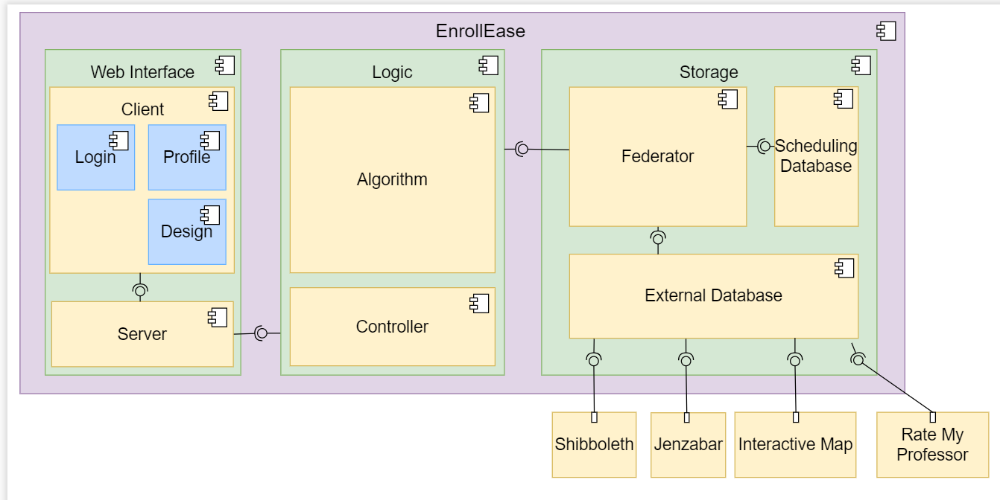
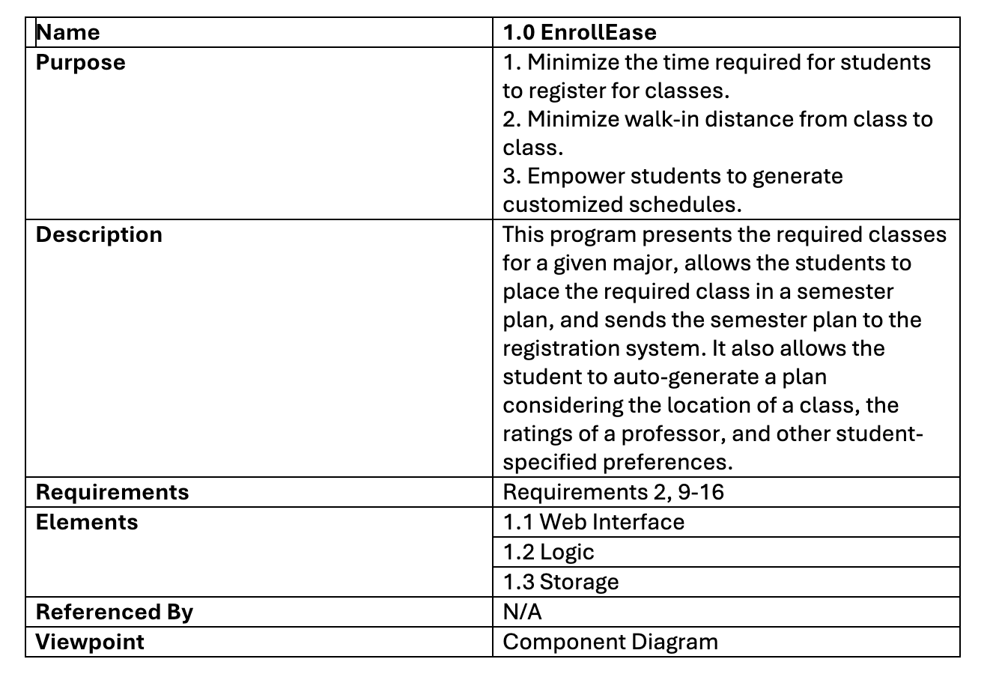

<<<<<<< HEAD

=======

| Name | 1.0 EnrollEase |
| ----------- | ----------- |
| Purpose | Minimize the time required for students to register for classes. Minimize walk-in distance from class to class. Empower students to generate customized schedules. |
| Description | This program presents the required classes for a given major, allows the students to place the required class in a semester plan, and sends the semester plan to the registration system. It also allows the student to auto-generate a plan considering the location of a class, the ratings of a professor, and other student-specified preferences. |
| Requirements | All |
| Elements | 1.1 Web Interface |
|          | 1.1.1 Client Views |
|          | 1.1.2 Server |
|          | 1.2 Logic |
|          | 1.2.1 Algorithm |
|          | 1.2.2 Controller |
|          | 1.3 Storage |
|          | 1.3.1 Federator |
|          | 1.3.2 Scheduling Database |
|          | 1.3.3 External Database |
|          | 1.3.4 Shibboleth |
|          | 1.3.5 Jenzabar |
|          | 1.3.6 Interactive Map |
|          | 1.3.7 Rate My Professor |
|  | 1.2 Logic |
|  | 1.3 Storage |
| Referenced by | N/A |
| Viewpoint | Component Diagram |
>>>>>>> 96cde566f725fb01629db17c70da7eae0b6a9e7c
