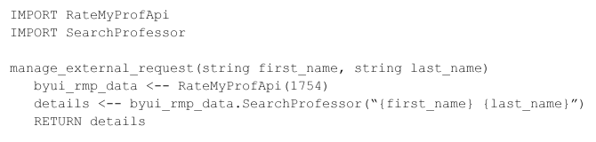

| **Name**          | **1.3.3.4.3 RateMyProfessor Manage External Requests**                                                                                                                                                                   |
|-------------------|--------------------------------------------------------------------------------------------------------------------------------------------------------------------------------------------------------------------------|
| **Purpose**       | Contacts the API for the external RateMyProfessor database and returns the professor's profile from the site.                                                                                                            |
| **Description**   | The API only needs a first and last name (we are hard-coding in BYU-I's ID number from RateMyProfessor).  By using the API, it will return a JSON object with the necessary data on the professor.                       |
| **Requirements**  | Requirement 8                                                                                                                                                                                                            |
| **Elements**      | **RateMyProfApi:** The API we need to use in order to get the professor's data.  When an ID number is passed in, it creates an object for the specified school, and that object holds all of the data on its professors. |
|                   | **SearchProfessor:** This method returns a JSON object on the specified professor.  It just needs a string with the professor's first and last name.                                                                     |
|                   | **first_name:** The first name of the professor.                                                                                                                                                                         |
|                   | **last_name:** The last name of the professor.                                                                                                                                                                           |
|                   | **BYUI:** The API object created for this function.  The number "1754" is the school's ID on RateMyProfessor.                                                                                                            |
|                   | **Details:** The JSON object with the professor's details on RateMyProfessor.                                                                                                                                            |
| **Referenced by** | 1.3.3.4                                                                                                                                                                                                                  |
| **Viewpoint**     | Pseudocode                                                                                                                                                                                                               |
